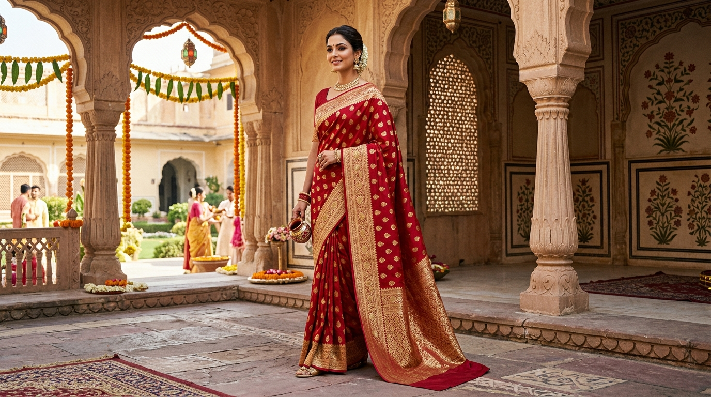

# PALLUVO — Every drape, a little magic.

> **Contemporary Luxury Indian Saree Fashion House & Boutique Atelier**



**PALLUVO** is a contemporary luxury Indian saree fashion house crafted for celebrations, traditions, and the modern muse (*“Every drape, a little magic.”*). Built with strict **100% saree merchandising** (strictly authentic sarees — zero lehengas, kurtis, salwar suits, gowns, or western wear), the platform moves beyond overwhelming 20+ category directories to focus on a curated boutique collection of **the top signature saree models**, honoring India's master artisans with museum-grade digital presentation, intuitive client-side catalog filtering, and a seamless shopping journey.

---

## 🌟 Key Architecture & Highlights

### 1. Brand Identity & Dedicated Saree Navigation
- **Brand Name**: `PALLUVO`
- **Tagline**: *“Every drape, a little magic.”*
- **Main Header Bar**: `PALLUVO` luxury wordmark, full-width instant search bar with live typeahead, and customer action buttons (Account, Wishlist, Cart Drawer with live item counter).
- **Curated Signature Navigation Links**:
  - `NEW ARRIVALS`
  - `KANJIVARAM`
  - `BANARASI`
  - `CHANDERI`
  - `PAITHANI`
  - `ORGANZA`
  - `READY-TO-WEAR`
  - `ALL SAREES`

### 2. Curated Boutique Homepage (`index.html`)
- **"PALLUVO" Editorial Hero Section**:
  - Headline: *"PALLUVO — Every drape, a little magic."*
  - Authentic Silk Mark Certified and Handloom Trust Badges.
  - Action buttons: `EXPLORE TOP MODELS` and `SHOP ALL SAREES`.
  - High-resolution editorial portrait of an authentic crimson & gold bridal drape.
- **"The Festive Edit" Promotional Banner**:
  - Gradient banner with *"UP TO 25% OFF"*, *"FREE SHIPPING ON ORDERS ABOVE ₹999"*, and direct promo link.
- **"The Top Saree Models" (Curated 6 Signature Drapes)**:
  1. **The Royal Kanjivaram** (Kanchipuram, Tamil Nadu) — 180+ Weaving Hours, Pure Mulberry Silk & Korvai Gold Temple Zari
  2. **The Heirloom Banarasi** (Varanasi, UP) — 210+ Weaving Hours, Pure Katan Silk with Real Zari Jaal
  3. **The Whispering Chanderi** (Chanderi, MP) — 95+ Weaving Hours, Gossamer Handloom Silk-Cotton Tissue
  4. **The Imperial Paithani** (Paithan, Maharashtra) — 160+ Weaving Hours, Kaleidoscopic Mor Bangdi Peacock Pallu
  5. **The Ethereal Organza** (Couture Atelier) — 75+ Embroidery Hours, Scalloped Hand-Embroidered Zardozi Sheer
  6. **The 1-Minute Ready Drape** (Signature Studio) — Pre-Pleated Tailored Pure Silk Drape for 60-second glamour
- **"Shop By Occasion" (Curated Collections)**:
  - Wedding, Bridal, Festive, Party Wear, Office Wear, Casual, Traditional, and Reception with curated recommendations.
- **"Trending Now" (12 Saree Products)**:
  - 12 sarees with INR pricing, compare-at pricing, discount percentages, star ratings, live color swatches, wishlist toggles, quick view, and one-click Add to Bag.
- **"The Handloom Edit"**:
  - Subtitle: *"Crafted by tradition. Woven for today."*
  - Highlighting 10 authentic weaving clusters: Varanasi, Kanchipuram, Paithan, Sualkuchi, Chanderi, Pochampally, Patan, Kota, Uppada, and Maheshwar.
- **"Navratri In Motion" Festive Spotlight**:
  - High-impact visual banner: *"Celebrate every twirl."* with festive styling and direct link to festive drapes.
- **5 Core Trust Pillars**:
  1. *Authentic Weaves* (Direct from master artisan clusters)
  2. *Quality Assured* (100% Silk Mark certified purity)
  3. *Secure Payments* (256-bit SSL encryption, UPI, Cards, NetBanking, COD)
  4. *Easy Returns* (Hassle-free 7-day pickup guarantee)
  5. *Fast Delivery* (Express insured dispatched across India & Worldwide)
- **Footer**:
  - Comprehensive customer care links, Saree Type quick links, regional cluster guide, trust badges, payment icons (UPI, RuPay, Visa, Mastercard, NetBanking, COD), and newsletter subscription (*"Join the Saree Circle"*).

---

## 🛍️ Secondary Pages & Functionality

1. **Saree Catalog & Filters (`sarees.html`)**:
   - Multi-facet client-side filter engine (Saree Type, Fabric, Occasion, Regional Cluster, Price Range slider, Color swatches, and Sorting).
   - Zero page reload instant updates with active tag chips and "Clear All".

2. **Product Detail Page (`product.html`)**:
   - Detailed Indian saree specifications:
     - Total Length: **5.5 meters saree + 0.8 meter unstitched blouse piece**
     - Weave Type & Artisan Cluster Origin
     - Zari Composition & Fabric Purity
     - Care Instructions: Dry clean only
   - Interactive photo gallery with zoom and thumbnail navigation.
   - Live Indian Pincode delivery estimator with dispatch calculation.
   - Accordions for Draping Guide, Weaver Story, Fabric Care, and Shipping & Returns.

3. **Cart & Slide-Out Drawer (`cart.html`)**:
   - Dynamic free-shipping meter (₹999 threshold).
   - Quantity adjustment, coupon codes (`FESTIVE25`, `SAREE10`), and gift-wrapping options.

4. **Streamlined Checkout (`checkout.html`)**:
   - Full support for Indian payment methods: UPI (PhonePe, GPay, Paytm with instant QR simulator and VPA input), Credit/Debit cards, NetBanking, and Cash on Delivery.
   - Secure order confirmation and generation of order receipt tracking.

5. **Customer Account & Tracking (`account.html`)**:
   - Real-time order progress timeline (*Confirmed → Handloom QC → Dispatched → Delivered*).
   - Saved delivery addresses and styling preferences.

6. **Customer Wishlist (`wishlist.html`)**:
   - Persistent wishlist with 1-click move to shopping bag.

7. **Brand & Weaver Story (`about.html`)**:
   - Heritage manifesto detailing artisan preservation, fair-trade weaver wages, and Silk Mark certification.

---

## 📁 Repository Structure (Next.js & React Architecture)

```
├── app/
│   ├── layout.tsx             # Root Layout (ShopProvider, Header, Announcement, Modals, Drawers, Footer)
│   ├── page.tsx               # Homepage (Editorial Hero, 8 Top Models, Festive Edit, Occasions, Looms)
│   ├── sarees/
│   │   └── page.tsx           # Saree Catalog & Faceted Filters (Type, Fabric, Occasion, Price, Colors)
│   ├── product/
│   │   ├── page.tsx           # Query param redirect fallback (?id=... / ?slug=...)
│   │   └── [slug]/
│   │       └── page.tsx       # Product Detail Page (5.5m+0.8m Specs, Gallery, Blouse Options, Pincode)
│   ├── cart/
│   │   └── page.tsx           # Full Shopping Bag (Free shipping meter, Gift packaging, Price breakdown)
│   ├── checkout/
│   │   └── page.tsx           # Streamlined Indian Checkout (Address, UPI, Cards, NetBanking, COD)
│   ├── wishlist/
│   │   └── page.tsx           # Saved Sarees (1-Click Move to Bag & Persistent State)
│   ├── account/
│   │   └── page.tsx           # Customer Dashboard & Live Courier Tracking (Blue Dart Air Timeline)
│   ├── about/
│   │   └── page.tsx           # Weaver Story & Brand Heritage Manifesto (Silk Mark Certified Purity)
│   ├── contact/
│   │   └── page.tsx           # Luxury Atelier & Concierge Hub (+91 84988 54323, Appointment Booking)
│   └── globals.css            # Complete Luxury Fashion Design System & Responsive Breakpoints
├── components/
│   ├── layout/
│   │   ├── AnnouncementBar.tsx # Top promotional banner
│   │   ├── Header.tsx          # Brand wordmark, desktop navigation, action icons & mobile hamburger
│   │   ├── MobileNavDrawer.tsx # Responsive slide-out navigation drawer (active at <=991px)
│   │   ├── CartDrawer.tsx      # Slide-out shopping bag drawer with free shipping progress meter
│   │   ├── SearchModal.tsx     # Live typeahead search modal with instant query matching
│   │   ├── WhatsAppConcierge.tsx # Floating stylist concierge link (+91 84988 54323)
│   │   └── Footer.tsx          # Customer care, collections, atelier address, payment badges, newsletter
│   ├── product/
│   │   ├── ProductCard.tsx     # Editorial product card with swatches, hover swap, quick view, bag add
│   │   └── QuickViewModal.tsx  # Quick preview modal with color & blouse customization
│   └── ui/
│       └── ToastContainer.tsx  # Floating action toast alerts (Add to bag, Wishlist updates)
├── context/
│   └── ShopContext.tsx        # React Context for Cart, Wishlist, Drawers, Modals, Coupons & Orders
├── data/
│   └── products.ts            # Saree catalog dataset, top models, occasions, loom regions & helpers
├── public/
│   └── images/                # High-definition editorial saree assets, category & occasion photography
├── next.config.js             # Next.js configuration
├── tsconfig.json              # TypeScript compiler configuration
├── package.json               # Next.js & React dependencies and scripts
└── README.md                  # Platform Documentation
```

---

## 🚀 Running Locally

### 1. Prerequisites
- **Node.js**: v18.0.0 or higher (v20+ recommended)
- **npm**: v9.0.0 or higher

### 2. Installation
Install project dependencies:
```bash
npm install
```

### 3. Development Server
Start the Next.js local development server:
```bash
npm run dev
```

Navigate to `http://localhost:3001/` (or `http://localhost:3000/`) in your browser to view the digital boutique.

### 4. Production Build & Start
To test the optimized production build:
```bash
npm run build
npm start
```

---

## 🛠️ Technology Stack

- **Framework**: [Next.js](https://nextjs.org/) (App Router, React Server Components & Client Components)
- **UI Library**: [React 18](https://react.dev/)
- **Type Safety**: [TypeScript](https://www.typescriptlang.org/)
- **Design System & Styling**: Custom Vanilla CSS with luxury design tokens, HSL tailored palettes, fluid CSS Grid, and responsive media queries.
- **State Management**: React Context (`ShopContext`) with hydration-safe `localStorage` synchronization for Cart, Wishlist, and Order Tracking.
- **Typography**: Google Fonts (*Playfair Display*, *Cormorant Garamond*, *Alex Brush*, and *Plus Jakarta Sans*).

