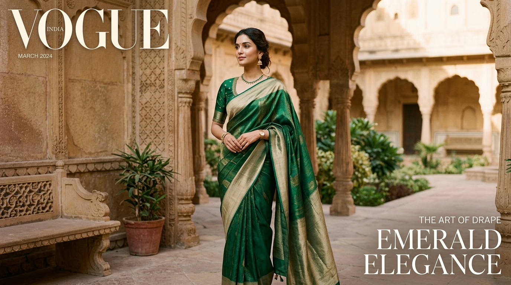

# PALLUVO — Every drape, a little magic

> **Contemporary Indian Luxury Saree Fashion House & E-commerce Platform**



PALLUVO is a modern Indian fashion brand focused on elegant, sophisticated sarees for modern women. The platform is designed with inspiration from luxury fashion houses and high-end D2C brands: generous whitespace, editorial typography, large high-fashion imagery, subtle micro-animations, refined product cards, and an intuitive conversion-focused shopping flow.

---

## Brand Aesthetic & Philosophy

- **Modern Indian Luxury**: Blending centuries of handloom weaving heritage with contemporary silhouettes and minimalist styling.
- **Palette**: Warm ivory (`#FAF7F2`), deep charcoal (`#1A1816`), muted warm gold (`#B38E5D`), soft champagne secondary tones (`#F4EFE6`), and rich jewel accents.
- **Typography**: Editorial serif typography (`Cormorant Garamond` & `Playfair Display`) paired with clean modern sans-serif (`Plus Jakarta Sans`).

---

## Key Pages & Architecture

1. **Homepage (`index.html`)**:
   - Announcement bar with complimentary shipping threshold (> ₹2,999)
   - Sticky navigation with desktop mega-menu & mobile drawer
   - Hero campaign section: *“Every drape, a little magic.”*
   - Featured Collections (*“Find Your Drape”*): Everyday Elegance, Festive Edit, Silk Stories, Contemporary Drapes, Wedding Edit
   - New Arrivals product grid with live color swatches, quick add, and quick view
   - Brand Story editorial split: *“The Art of the Drape”*
   - Shop by Mood: Soft & Romantic, Bold & Beautiful, Minimal & Modern, Festive & Opulent
   - Bestsellers (*“Loved by Her”*) with customer star ratings
   - The PALLUVO Edit styling journal articles
   - Community Instagram proof grid (*“Seen in the PALLUVO World”*)
   - Newsletter subscription (*“A little magic, delivered.”*)
   - Comprehensive luxury footer with Indian payment badges (UPI, RuPay, Visa, Mastercard, COD)

2. **Catalog & PLP (`sarees.html`)**:
   - Dynamic left filter sidebar: Category, Price range slider, Color swatches, Fabric, Occasion, Availability
   - Sort by dropdown (Featured, Price Low-High, Price High-Low, Highest Rated, New Arrivals)
   - Active filter tags with "Clear All"
   - Real-time client-side filtering without page reloads

3. **Product Detail Page (`product.html`)**:
   - Interactive zoom image gallery with thumbnail switcher
   - Dynamic product ID loading (`?id=noor-silk-saree`, etc.)
   - Compare-at pricing with discount percentages and tax transparency
   - Live color swatch selector
   - Blouse customization options (Unstitched / Custom Tailored / Ready-to-Wear) with Size Guide modal
   - Indian Pincode delivery date estimator
   - Expandable accordions: Product Details, Fabric & Care, Shipping & Returns, Blouse & Draping Guide
   - *Complete the Look* pairing recommendations & *You May Also Like* carousel
   - Verified customer reviews breakdown with star rating distribution and *Write a Review* modal

4. **Shopping Bag (`cart.html`) & Slide-out Cart Drawer**:
   - Free shipping progress bar (calculating amount needed to unlock complimentary shipping)
   - Quantity steppers, remove, move to wishlist
   - Promo coupon validation (`PALLUVO10` for 10% off, `FIRSTDRAPE` for ₹500 off)
   - Complimentary luxury gift packaging toggle with handwritten calligraphy note

5. **Distraction-Free Checkout (`checkout.html`)**:
   - 4-step streamlined accordion: Contact Info, Delivery Address with Indian states, Shipping Method, Payment Methods
   - Support for Indian payment systems: UPI (PhonePe, GPay, Paytm with QR code simulator and UPI ID entry), Credit/Debit Cards, NetBanking, Cash on Delivery
   - Sticky order summary and security badges
   - Order confirmation modal generating unique Order IDs (e.g. `#PAL-89241`), tracking numbers, and receipt links

6. **Customer Account Portal (`account.html`)**:
   - Active and past orders with 4-step tracking timeline (*Order Confirmed &rarr; QC & Finishing &rarr; Dispatched via Bluedart &rarr; Delivered*)
   - Saved shipping addresses management
   - Profile & concierge styling preferences

7. **Saved Wishlist (`wishlist.html`)**:
   - Grid of saved drapes with direct *Move to Bag* and *Remove* actions

8. **Editorial Brand Story (`about.html`)**:
   - *“The Story Behind the Drape”*: Brand manifesto, ethical weaver cluster partnerships across Varanasi, Kanchipuram, and Chanderi, and 100% certified silk values

---

## Project Structure

```
├── index.html          # Homepage
├── sarees.html         # Product Listing Page / Catalog
├── product.html        # Product Detail Page (PDP)
├── cart.html           # Dedicated Shopping Bag Page
├── checkout.html       # Checkout & Order Placement
├── wishlist.html       # Customer Wishlist
├── account.html        # Customer Account & Order Tracking
├── about.html          # Editorial Brand Story
├── css/
│   └── style.css       # Luxury Design System & Component Styles
├── js/
│   ├── products.js     # 10 Saree Catalog Data Models & Queries
│   └── store.js        # Cart, Wishlist, Orders, Search, Modals, Toasts
├── images/             # 37 Curated & Generated Luxury Editorial Assets
├── server.ps1          # Lightweight Local HTTP Dev Server
└── README.md           # Documentation
```

---

## Local Development

Run the included local development server in PowerShell:
```powershell
powershell -ExecutionPolicy Bypass -File server.ps1
```
Open your browser at `http://localhost:3000/`.

---

## Technologies Used

- **HTML5**: Semantic tags, accessibility attributes, schema-ready structure
- **Vanilla CSS3**: Design tokens, fluid typography, flexbox/grid layouts, micro-animations
- **Vanilla JavaScript (ES6+)**: Unified client-side state, `localStorage` persistence, debounced live search, interactive modals, and toast notifications
